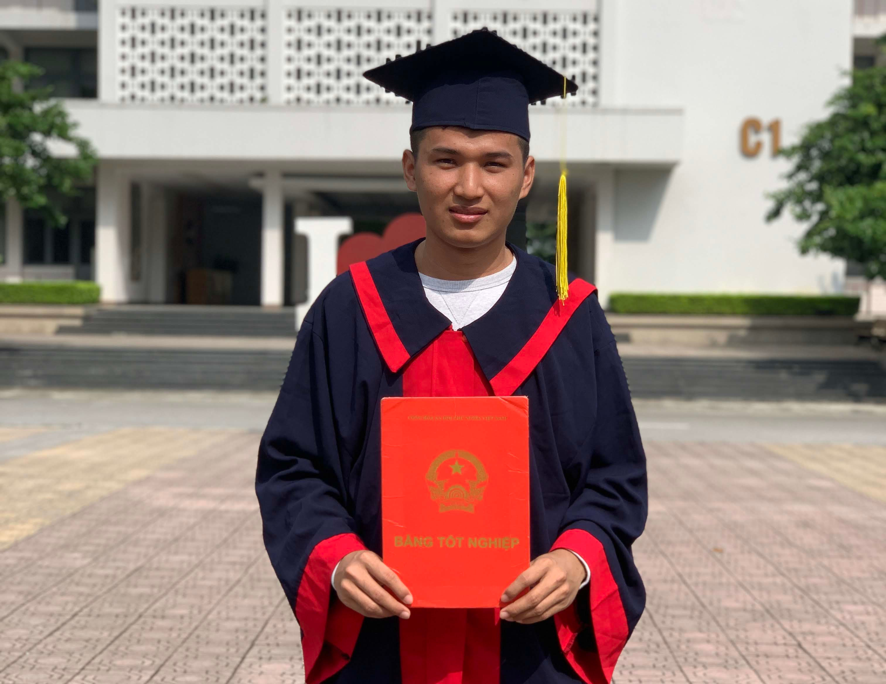

> **សួស្តី** _ខ្ញុំពិតជារីកខ្លាំងណាស់ អ្នកបានចូលមកកាន់ទំព័រនេះ មកអានព័ត៌មានពីខ្ញុំ_

ខ្ញុំសូមណែនាំខ្លួនបន្តិចចោះ ខ្ញុំមកពីស្រុកបាភ្នំ ខេត្តព្រៃវែង ជាកូនច្បងក្នុងគ្រួសារកសិករ ដែលចូលចិត្តកុំព្យូទ័រពីវ័យក្មេងមក តែមិនចេះអីទេ គ្រាន់តែព្យាយាមរកពីនេះពីនោះ គ្រាន់តែសន្សំសម្រាប់ទុកចែករំលែកអ្នកដែលកំពុងស្វែងរកវាដូចខ្ញុំដែរ។

ប្រវត្តិការសិក្សា៖

- ចប់ថ្នាក់បរិញ្ញាបត្រ សាលាពហុបច្ចេកទេសហាណូយ ផ្នែកព័ត៌មានវិទ្យា ខែកញ្ញា ឆ្នាំ២០១៧ ដល់ខែតុលា ឆ្នាំ២០២១
- ចប់ថ្នាក់រៀនភាសាវៀតណាម ឆ្នាំ២០១៦ ដល់ឆ្នាំ២០១៧
- ចប់ថ្នាក់វិស្វករមូលដ្ឋាន សាលាតិចណូ ឆ្នាំ២០១៥ ដល់ឆ្នាំ២០១៦

{: .center width="500" height="300"}
_Hanoi Pre-graduation picture at 2021_

អ្វីដែលជំនួយមកដល់ទីនេះ ខ្ញុំពិតជាអរគុណអ្នកមានគុណរបស់ខ្ញុំមានក្រុមគ្រួសារ យាយតា អ៊ុំប្រុសអុំ៊ស្រី ពូមីង និងមិត្តភក្តិទាំងអស់ដែលតែងតែជួយផ្តល់កម្លាំងចិត្តកាលកន្លងមក។ បច្ចុប្បន្នខ្ញុំកំពុងបំរើ ការងារក្រុមហ៊ុនឯកជនមួយ ផ្នែក `Full Stack Developer` និង ពេលទំនេរក៏បានធ្វើ `Project` មួយចំនួនផងដែរ។

កម្មវិធីបានចូលរួមអភិវឌ្ឍន៍៖

- **[Telegram Scrapper](https://github.com/samreachyan/telegram)** ជាកម្មវិធី ប្រើប្រាស់ `API` តេលេក្រាមដើម្បីយកទិន្នន័យធ្វើការងារ
- **[សាកកូដ - SakCode](https://sakcode.net)**
  ជាកម្មវិធីសម្រាប់ហ្វឹកហាត់រៀនសរសេរដោះស្រាយលំហាត់កូដ អាចដោះស្រាយជាមួយភាសាដូចជា `C`,`C++`, `Python`, `Java` ជាភាសាដែលគេនិយមធ្វើការប្រលងប្រជែកដោះស្រាយលំហាត់គណិត
- វេបសាយ **[E-learning](https://github.com/samreachyan/project-datn)** ដែលជាគម្រោងសម្រាប់ការបញ្ចប់ការសិក្សាថ្នាក់បរិញ្ញាបត្រ ដោយប្រើ `Laravel Framework`
- ធ្លាប់សរសេរកម្មវិធីសាកល្បងតូចជាមួយ `React JS`, `NodeJS` , `React Native` សម្រាប់កម្មវិធីទូរសព្ទដៃ

### ទំនាក់ទំនង

- [x] [តេលេក្រាម](https://t.me/samreachyan)
- [x] [ហ្វេសប៊ុក](https://me.fb.com/yan.samreach)
- [x] [អ៊ីមែល](mailto:samreachyan@gmail.com)
- [x] គាំទ្រទំព័រ [Facebook Page](https://www.facebook.com/samreachyan.sakcode)
- [x] គាំទ្រ និងលើកទឹកចិត្ត `ABA` - **001 440 232** ❤️❤️
- [ ] បណ្តាញផ្សេងៗ
